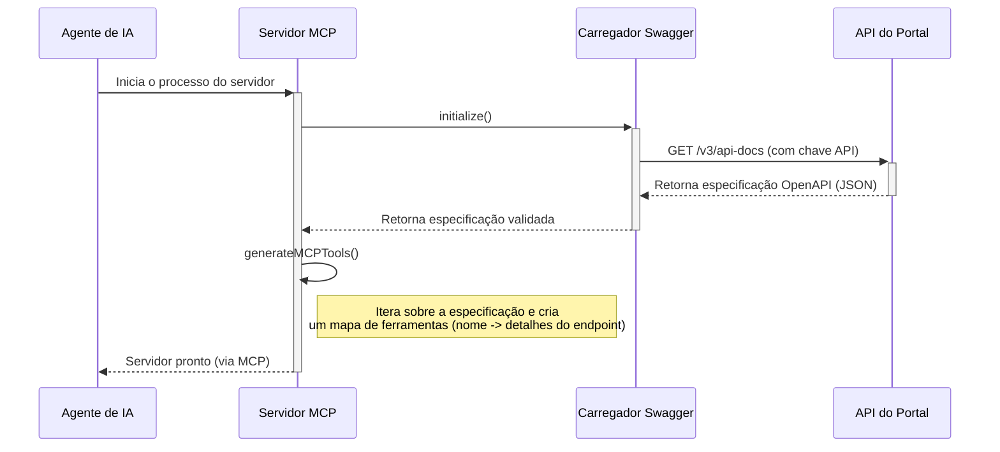
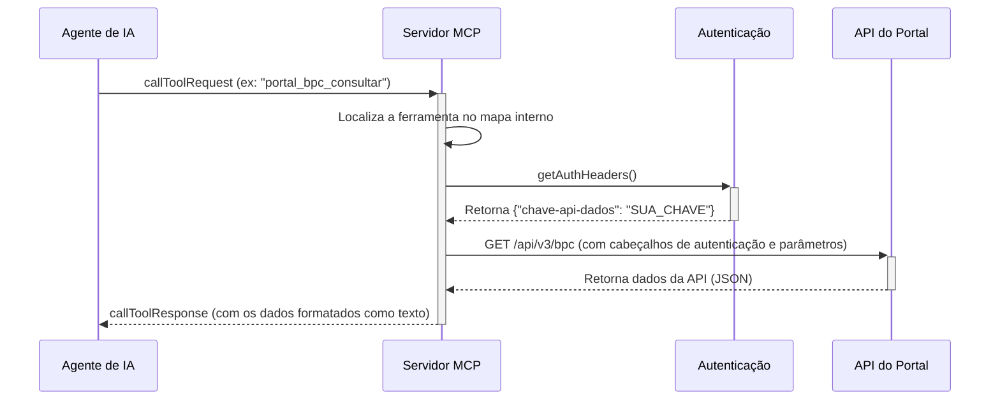

# Arquitetura do Sistema: MCP para o Portal da Transparência

## 1. Visão Geral de Alto Nível

Este sistema atua como um **Servidor de Protocolo de Chamada de Múltiplas Etapas (MCP)**, projetado para servir como uma ponte inteligente entre um agente de IA (como o Gemini) e a API do Portal da Transparência do Governo Brasileiro.

O objetivo principal é expor as complexas funcionalidades da API do Portal da Transparência como um conjunto de "ferramentas" discretas e fáceis de usar que um modelo de linguagem grande (LLM) pode invocar. Isso abstrai a complexidade da API, como a necessidade de paginação, formatação de parâmetros e autenticação, permitindo que o agente se concentre em responder às perguntas do usuário de forma eficiente.

O sistema é construído em **TypeScript** e executado no ambiente **Node.js**. Ele é projetado para ser iniciado como um processo de servidor que se comunica com o agente de IA através de transporte de E/S padrão (stdio), seguindo as especificações do MCP.

## 2. Componentes Principais

A arquitetura é modular e composta pelas seguintes classes principais:

### a. `MCPPortalServer` (`src/mcp-server.ts`)

- **Responsabilidade:** É o coração do sistema. Orquestra todos os outros componentes e gerencia o ciclo de vida do servidor MCP.
- **Funcionalidades:**
    - Inicializa e conecta o servidor MCP usando o SDK `@modelcontextprotocol/sdk`.
    - Define os manipuladores de requisições do MCP (`initialize`, `listTools`, `callTool`).
    - Carrega a especificação da API (Swagger/OpenAPI) no início.
    - Gera dinamicamente as "ferramentas" MCP com base nos endpoints da API.
    - Executa as chamadas à API real quando uma ferramenta é invocada pelo agente.

### b. `SwaggerLoader` (`src/core/SwaggerLoader.ts`)

- **Responsabilidade:** Carregar, validar e analisar a especificação OpenAPI (Swagger) da API do Portal da Transparência.
- **Funcionalidades:**
    - Busca a especificação `api-docs` (em formato JSON) a partir de uma URL.
    - Utiliza a biblioteca `swagger-parser` para validar a estrutura da especificação.
    - Mantém uma cópia em cache da especificação para evitar downloads repetidos.
    - Fornece metadados básicos sobre a API, como título, versão e número de endpoints.

### c. `Authentication` (`src/core/Authentication.ts`)

- **Responsabilidade:** Gerenciar a autenticação com a API do Portal da Transparência.
- **Funcionalidades:**
    - Armazena e gerencia a chave da API (`chave-api-dados`).
    - Fornece os cabeçalhos de autenticação necessários para cada requisição à API.
    - Inclui métodos para validar o formato da chave e testar sua validade fazendo uma chamada de teste à API.
    - Abstrai os detalhes do cabeçalho de autenticação (`headerName`).

### d. `ClientGenerator` (`src/core/ClientGenerator.ts`)

- **Responsabilidade:** Gerar clientes TypeScript estáticos e tipados para a API.
- **Funcionalidades:**
    - Analisa a especificação OpenAPI carregada.
    - Agrupa os endpoints da API por *tags* (ex: "beneficios", "licitacoes").
    - Usa templates (Handlebars) para gerar um arquivo `.ts` para cada *tag*, contendo uma classe de cliente com métodos que correspondem a cada endpoint.
    - Gera automaticamente interfaces TypeScript para os parâmetros das requisições, melhorando a segurança de tipos e o autocompletar no desenvolvimento.
    - **Nota:** Embora presente, este componente parece ser mais uma ferramenta de desenvolvimento para gerar código de cliente estático, enquanto o `MCPPortalServer` gera as ferramentas dinamicamente em tempo de execução.

### e. `Logger` (`src/logging/Logger.ts`)

- **Responsabilidade:** Fornecer um sistema de logging estruturado e configurável.
- **Funcionalidades:**
    - Utiliza a biblioteca `winston` para criar logs com diferentes níveis (info, warn, error).
    - Permite a configuração do nível de log através de variáveis de ambiente (`LOG_LEVEL`).
    - Garante que a saída do servidor seja consistente e útil para depuração.

## 3. Diagrama de Fluxo de Dados

### a. Fluxo de Inicialização

### b. Fluxo de Chamada de Ferramenta

## 4. Decisões de Design e Justificativa

- **Geração Dinâmica de Ferramentas:** Em vez de codificar manualmente cada ferramenta, o sistema gera-as dinamicamente a partir da especificação OpenAPI.
    - **Justificativa:** Isso torna o sistema resiliente a mudanças na API do Portal da Transparência. Se novos endpoints forem adicionados, basta reiniciar o servidor para que eles se tornem disponíveis como novas ferramentas, sem necessidade de alteração no código.

- **Abstração da API Key:** A chave da API é gerenciada centralmente pela classe `Authentication` e injetada nas chamadas.
    - **Justificativa:** Desacopla a lógica de negócio da autenticação. O agente de IA não precisa saber sobre a existência de uma chave de API; ele simplesmente invoca a ferramenta.

- **Nomenclatura de Ferramentas:** As ferramentas recebem nomes descritivos e prefixados (ex: `portal_bpc_consultar`).
    - **Justificativa:** A nomenclatura estruturada (`portal_<categoria>_<operação>`) ajuda o LLM a entender o domínio e a finalidade de cada ferramenta, melhorando a precisão na seleção da ferramenta correta para uma determinada tarefa.

- **Uso do SDK do MCP:** O sistema adere estritamente ao protocolo definido pelo `@modelcontextprotocol/sdk`.
    - **Justificativa:** Garante a interoperabilidade com qualquer cliente ou agente que implemente o mesmo protocolo, promovendo um ecossistema padronizado.

## 5. Restrições e Limitações do Sistema

- **Dependência da Especificação OpenAPI:** A qualidade e a precisão das ferramentas geradas dependem inteiramente da qualidade da especificação OpenAPI fornecida pelo Portal da Transparência. Se a especificação estiver desatualizada, incompleta ou incorreta, as ferramentas refletirão essas falhas.
- **Limitação de Tipos de Dados:** Atualmente, o sistema mapeia todos os tipos de resposta da API para `string` no esquema de ferramentas do MCP e retorna o JSON como texto.
    - **Impacto:** O agente de IA recebe uma "stringona" de JSON e precisa analisá-la por conta própria. Uma melhoria futura poderia ser a geração de esquemas de saída mais detalhados para que o agente receba objetos estruturados.
- **Tratamento de Erros:** Embora o sistema capture erros de rede e HTTP, ele os retorna como uma mensagem de texto formatada para o agente.
    - **Impacto:** O agente precisa analisar a mensagem de erro em texto para entender o que deu errado. O protocolo MCP pode permitir o retorno de erros mais estruturados, o que seria uma melhoria.
- **Escalabilidade:** O servidor é de processo único e carrega toda a especificação na memória.
    - **Impacto:** Para a API do Portal da Transparência, isso é perfeitamente aceitável. No entanto, para APIs com dezenas de milhares de endpoints, essa abordagem poderia consumir muita memória.
